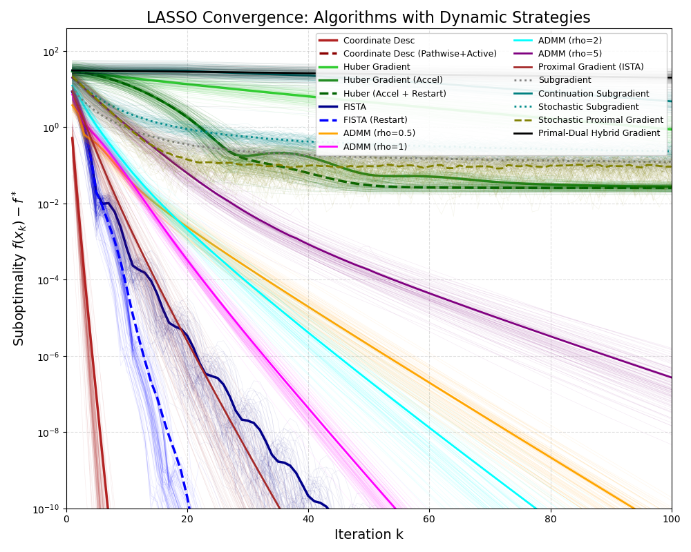
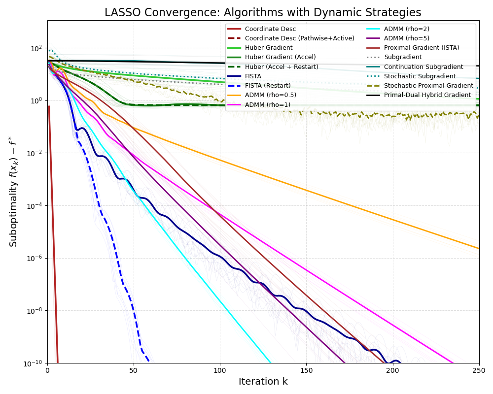

# LASSO Optimization Algorithms – Dynamic Strategies
# LASSO 回归优化算法：动态策略全景

## 📘 项目简介 (Introduction)

围绕 **LASSO (Least Absolute Shrinkage and Selection Operator)** 的求解，本项目在同一代码框架下系统比较了多种经典与改进型算法的收敛行为。分析聚焦于：

* **可分结构**（坐标下降、原始-对偶混合等）与 **近端/次梯度策略**（ISTA、FISTA、Huber、PDHG、随机近端更新）。
* **动态技巧**（路径追踪、Active-set、动量重启、参数续接、原始—对偶耦合）对收敛速度与稳定性的影响。
* **低维常规场景**与 **高维强病态场景** 的差异，以及不同算法在 suboptimality 视角下的完整迭代轨迹。

目标函数采取标准形式：
```
min_beta (1/(2n))‖y - Xβ‖_2^2 + λ ‖β‖_1
```

## 🧪 实验设置 (Experimental Setup)

| 设置项 | 场景 A：低维低病态 (Low-Dim) | 场景 B：高维高病态 (High-Dim) |
| :--- | :--- | :--- |
| **样本数 (n)** | 200 | 200 |
| **特征数 (p)** | 50 | **1000** |
| **真值稀疏度** | 前 10 个系数非零 | 前 10 个系数非零 |
| **正则化权重** | λ = 0.1·λ_max | λ = 0.1·λ_max |
| **最大迭代** | 100 | 250 |
| **重复实验** | 100 次独立试验 | 10 次独立试验 |
| **收敛判据** | f(x_k) - f* ≤ 1e-6 | 同左 |

补充说明：

* f* 由高精度 scikit-learn Lasso 求解得到。
* 细线表示单次试验的轨迹（cloud plot），粗线为均值。
* 所有实验数据、可视化及统计均位于 `verson_2/` 目录，便于复现及引用。

## 🚀 实现算法 (Implemented Algorithms)

1. **Coordinate Descent 系列**：标准坐标下降与 Pathwise+Active-set 策略（沿 λ 路径 warm-start 并周期性 KKT 扫描）。
2. **Huber Gradient 家族**：原始、加速、加速+重启三种形态，用平滑近似追踪 L1 目标。
3. **FISTA / ISTA**：含动量重启 (FISTA-R) 的 Nesterov 近端梯度，以及基线 ISTA。
4. **ADMM (ρ∈{0.5,1,2,5})**：考察惩罚参数对速度与稳定性的影响。
5. **Subgradient 家族**：经典次梯度、continuation 次梯度、随机次梯度。
6. **Stochastic Proximal Gradient (SPG)**：mini-batch 近端梯度，与随机次梯度形成对照。
7. **Primal-Dual Hybrid Gradient (PDHG)**：Chambolle-Pock 式原始对偶耦合迭代。

## 🧠 算法解读 (Algorithm Notes)

- **Coordinate Descent (CD)**：依次最小化单个坐标子问题，并用 (β_j ← S_{λ/A_j}(c_j/A_j)) 的软阈值更新展示 L1 可分结构 (Sequential coordinate-wise minimization)。
- **Coordinate Desc (Pathwise+Active)**：沿几何递减的 λ 路径 warm-start，并只在激活集与周期性 KKT 扫描上循环，等价于 homotopy + screening 的组合 (Homotopy warm starts plus active screening)。
- **Huber Gradient / Accel / Restart**：用 Huber 平滑项 h_δ(β) 替代 L1，比较标准、加速、加速+重启梯度在 grad f + λ·grad h_δ 上的行为 (Smooth approximation under classic/accelerated/restart schemes)。
- **FISTA**：Nesterov 动量与软阈值近端结合，依靠 t_{k+1} 控制加速项以实现 O(1/k^2) 收敛 (Momentum-accelerated proximal gradient)。
- **FISTA (Restart)**：当 <z_k-β_{k+1}, β_{k+1}-β_k> > 0 时重置动量，消除“锯齿”并保持 FISTA 的快速衰减 (Adaptive restart to suppress oscillations)。
- **Proximal Gradient (ISTA)**：固定步长 1/L 配合软阈值作为无动量的近端基线，提供平滑但稍慢的下降 (Baseline proximal updates without momentum)。
- **ADMM (ρ=0.5/1/2/5)**：通过
  ```
  β^{k+1} = (X^T X / n + ρ I)^-1 (X^T y / n + ρ(z^k - u^k))
  z^{k+1} = S_{λ/ρ}(β^{k+1} + u^k)
  ```
  实现原始-近端分块更新，不同 ρ 决定收敛速度和稳定性 (Classical splitting with varying penalty strength)。
- **Subgradient**：采用 g_k = X^T(Xβ_k - y)/n + λ s_k 与 a_k = a_0/√k，体现 O(1/√k) 的理论速率 (Plain diminishing-step subgradient)。
- **Continuation Subgradient**：将 λ 从 λ_max 逐段递减，每段执行少量次梯度，模拟粗到细的续接 (Multi-stage decreasing-λ warm starts)。
- **Stochastic Subgradient**：用 mini-batch 梯度 X_b^T(X_bβ - y_b)/|b| 估计 g_k，在 1/√k 步长下展示噪声驱动的振荡 (Mini-batch stochastic variant)。
- **Stochastic Proximal Gradient**：对 mini-batch 梯度立即执行软阈值，兼具随机性与近端收缩 (Stochastic proximal shrinkage)。
- **Primal-Dual Hybrid Gradient (PDHG)**：按照
  ```
  d^{k+1} = (d^k + σ(X beta_bar^k - y)) / (1 + σn)
  β^{k+1} = S_{τλ}(β^k - τ X^T d^{k+1})
  beta_bar^{k+1} = β^{k+1} + θ(β^{k+1} - β^k)
  ```
  同步推进原始与对偶，展现 Chambolle-Pock 式耦合 (Simultaneous primal-dual coupling)。

## 🎯 图例与直觉 (Visualization Legend)

| 颜色 | 线型 | 算法 | 直观解读 |
| :--- | :--- | :--- | :--- |
| `firebrick` | 实线 | Coordinate Desc | 指数级下落，少量迭代即贴近最优。 |
| `darkred` | 虚线 | Coordinate Desc (Pathwise+Active) | 借助路径追踪与 Active-set，常见“一步到位”现象。 |
| `limegreen` | 实线 | Huber Gradient | 线性渐近，受平滑误差限制在 1e-2 左右。 |
| `forestgreen` | 实线 | Huber Gradient (Accel) | 前期更快，后期仍停留在平滑误差平台。 |
| `darkgreen` | 虚线 | Huber (Accel+Restart) | 重启消除局部震荡，但极限误差仍受 Huber 近似制约。 |
| `darkblue` | 实线 | FISTA | 动量驱动的快速下降，出现明显“锯齿”震荡。 |
| `blue` | 虚线 | FISTA (Restart) | 自动重启压制震荡，实现平滑逼近。 |
| `orange` | 实线 | ADMM (ρ=0.5) | 步长偏大导致后期拖尾。 |
| `magenta` | 实线 | ADMM (ρ=1) | 低维表现最佳，速度与稳定性兼顾。 |
| `cyan` | 实线 | ADMM (ρ=2) | 高维下新的最佳点，抑制震荡。 |
| `purple` | 实线 | ADMM (ρ=5) | 惩罚过大，更新幅度受限。 |
| `brown` | 实线 | Proximal Gradient (ISTA) | 平滑但略慢的基线近端梯度。 |
| `gray` | 点线 | Subgradient | 维持在误差平台，理论基准。 |
| `teal` | 实线 | Continuation Subgradient | 随 λ 续接但仍停留在台阶。 |
| `darkcyan` | 点线 | Stochastic Subgradient | 随机噪声放大震荡，长时间不降。 |
| `olive` | 虚线 | Stochastic Proximal Gradient | 随机近端更新，下降平缓。 |
| `black` | 实线 | Primal-Dual Hybrid Gradient | 原始对偶耦合，受步长限制在高误差区。 |

---

## 🌄 场景 A：低维收敛剖析 (n=200, p=50)



### 🔍 关键洞察

* **Pathwise+Active-set**：平均与中位迭代数均为 1（100% 试验一次到位），warm start + KKT 检查完全释放稀疏结构。
* **标准坐标下降**：平均 4.21 次、最坏 6 次，实现可预测的线性收敛。
* **FISTA vs. FISTA-R**：20.33 vs. 12.23 次迭代，重启以轻微初期减速换取后期稳定性。
* **ISTA**：19.81 次，位于 FISTA 与 ADMM 之间，验证了“无动量”的平滑下降轨迹。
* **ADMM**：ρ=1 (32.89 次) 最优，ρ=0.5 与 ρ=5 分别表现为步长过大/过小的典型拖尾。
* **Huber 与各类次梯度/随机算法**：在 100 步限制内都停留在误差平台，强调了非平滑问题对步长选择的敏感度。

### 📊 收敛统计 (tol = 10^{-6}, 100 Trials)

| 算法 | 平均迭代 | 中位 | 最少 | 最多 | 提前收敛 |
| :--- | ---: | ---: | ---: | ---: | ---: |
| Coordinate Desc | 4.21 | 4.00 | 3 | 6 | 100% |
| Coordinate Desc (Pathwise+Active) | **1.00** | **1.00** | 1 | 1 | **100%** |
| Huber Gradient | 100.00 | 100.00 | 100 | 100 | 0% |
| Huber Gradient (Accel) | 100.00 | 100.00 | 100 | 100 | 0% |
| Huber (Accel + Restart) | 100.00 | 100.00 | 100 | 100 | 0% |
| FISTA | 20.33 | 20.00 | 15 | 24 | 100% |
| FISTA (Restart) | 12.23 | 12.00 | 9 | 15 | 100% |
| ADMM (ρ=0.5) | 52.18 | 52.00 | 46 | 61 | 100% |
| ADMM (ρ=1) | 32.89 | 33.00 | 29 | 36 | 100% |
| ADMM (ρ=2) | 43.75 | 43.00 | 36 | 53 | 100% |
| ADMM (ρ=5) | 86.70 | 86.00 | 69 | 100 | 93.0% |
| Proximal Gradient (ISTA) | 19.81 | 19.50 | 13 | 26 | 100% |
| Subgradient | 100.00 | 100.00 | 100 | 100 | 0% |
| Continuation Subgradient | 100.00 | 100.00 | 100 | 100 | 0% |
| Stochastic Subgradient | 100.00 | 100.00 | 100 | 100 | 0% |
| Stochastic Proximal Gradient | 100.00 | 100.00 | 100 | 100 | 0% |
| Primal-Dual Hybrid Gradient | 100.00 | 100.00 | 100 | 100 | 0% |

---

## 🌋 场景 B：高维收敛剖析 (n=200, p=1000)



### 💡 关键观察

* **维度提升后的动量震荡**：FISTA 平均 90.40 次、出现大幅“锯齿”；FISTA-Restart 将迭代压缩到 39.40 次并保持平滑。
* **ADMM 惩罚系数漂移**：ρ=2 平均 80 次成为新的甜蜜点；ρ=0.5 在 250 步内无法达标，ρ=5 虽收敛但速度明显下降。
* **原始-对偶与各类次梯度**：受限于固定步长/续接策略，全部达到 250 步上限仍未满足 tol，凸显高维病态下对更强 preconditioning 的需求。
* **坐标类方法**：即使在 p=1000，标准坐标下降保持 4 次量级，Pathwise+Active 依旧“一步到顶”，说明可分结构与 warm start 对特征规模几乎不敏感。

### 📊 收敛统计 (tol = 10^{-6}, 10 Trials)

| 算法 | 平均迭代 | 中位 | 最少 | 最多 | 提前收敛 |
| :--- | ---: | ---: | ---: | ---: | ---: |
| Coordinate Desc | 4.00 | 4.00 | 3 | 5 | 100% |
| Coordinate Desc (Pathwise+Active) | **1.00** | **1.00** | 1 | 1 | **100%** |
| Huber Gradient | 250.00 | 250.00 | 250 | 250 | 0% |
| Huber Gradient (Accel) | 250.00 | 250.00 | 250 | 250 | 0% |
| Huber (Accel + Restart) | 250.00 | 250.00 | 250 | 250 | 0% |
| FISTA | 90.40 | 91.00 | 81 | 102 | 100% |
| FISTA (Restart) | 39.40 | 39.00 | 37 | 43 | 100% |
| ADMM (ρ=0.5) | 250.00 | 250.00 | 250 | 250 | 0% |
| ADMM (ρ=1) | 138.30 | 138.50 | 132 | 146 | 100% |
| ADMM (ρ=2) | 80.00 | 79.50 | 77 | 84 | 100% |
| ADMM (ρ=5) | 106.00 | 105.50 | 92 | 116 | 100% |
| Proximal Gradient (ISTA) | 120.90 | 118.50 | 109 | 135 | 100% |
| Subgradient | 250.00 | 250.00 | 250 | 250 | 0% |
| Continuation Subgradient | 250.00 | 250.00 | 250 | 250 | 0% |
| Stochastic Subgradient | 250.00 | 250.00 | 250 | 250 | 0% |
| Stochastic Proximal Gradient | 250.00 | 250.00 | 250 | 250 | 0% |
| Primal-Dual Hybrid Gradient | 250.00 | 250.00 | 250 | 250 | 0% |

---

## ⏱️ 时间复杂度透视 (Time Complexity)

| 算法 | 单次迭代复杂度 | 主要瓶颈 | 对高维 (p ≫ n) 的敏感度 |
| :--- | :--- | :--- | :--- |
| Coordinate Desc / Pathwise+Active | O(np) | 向量内积、残差更新 | **线性**：warm start 令迭代轮数几乎常数化。 |
| FISTA / ISTA / Stochastic Proximal | O(np) 或 O(nb) | X^T(Xβ - y)（或 mini-batch 版本） | 线性增长，动量/重启决定震荡水平。 |
| Huber Gradient 家族 | O(np) | 平滑梯度计算 + 步长限制 | 线性但存在误差地板。 |
| ADMM | 预处理 O(p^3)，迭代 O(p^2) | 求解 (X^TX + ρ I)^{-1} | **立方**：高维下成为主要瓶颈。 |
| (Stochastic) Subgradient | O(np) 或 O(nb) | 次梯度 + 步长调度 | 线性，但 1/√{k} 衰减过慢。 |
| Primal-Dual Hybrid Gradient | O(np) | 原始-对偶乘积与投影 | 线性，对步长超参数较敏感。 |

结论：当 p 上升到千维量级时，唯一真正爆炸的是 ADMM 的预处理；坐标系类与（随机）近端梯度则凭借向量化运算保持了良好扩展性。

---

## ✅ 综合结论 (Conclusion)

1. **路径 + Active-set** 构成全局最稳健的收敛策略——在两个场景里都以 1 次迭代触达 tol。
2. **动量重启是动量算法的“安全带”**：FISTA-R 在高维场景下减少了 2×+ 的迭代并彻底消除震荡。
3. **ADMM 惩罚参数会随维度迁移**：低维推荐 ρ≈ 1，高维则需要提升到 ρ≈ 2 才能兼顾速度与稳定。
4. **近端与次梯度的落差**：ISTA 仍能稳定下降，而纯次梯度（含随机/续接）与基于平滑近似的 Huber 系列在固定步长与迭代上限下难以穿透误差平台。
5. **原始-对偶混合适合作为结构提醒**：PDHG 的轨迹表明，若无额外 preconditioning，其步长选择仍受限，但在需要显式对偶变量的场合依然是可行基线。

---

## 💻 复现指引 (How to Reproduce)

1. 安装依赖：
   ```bash
   pip install numpy matplotlib scikit-learn
   ```
2. 运行实验：
   ```bash
   cd verson_2
   python 2.py
   ```
   该脚本会自动完成所有随机试验、输出收敛统计 (`收敛情况.md`)，并生成 `低维.png` 与 `高维.png` 两幅收敛曲线。
3. 若需调整场景或参数，可直接修改 `2.py` 顶部的统一配置（样本/特征规模、迭代上限、试验次数、惩罚权重等）。

保持上述流程即可在本目录获得完整的数值对比结果，方便在报告或演示中引用。祝研究顺利！
